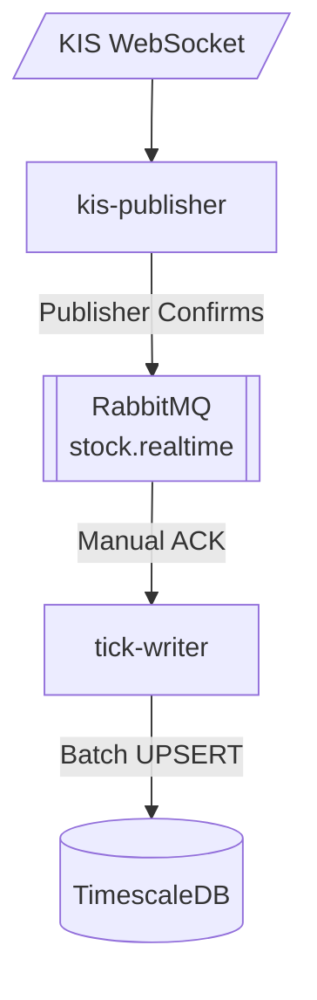
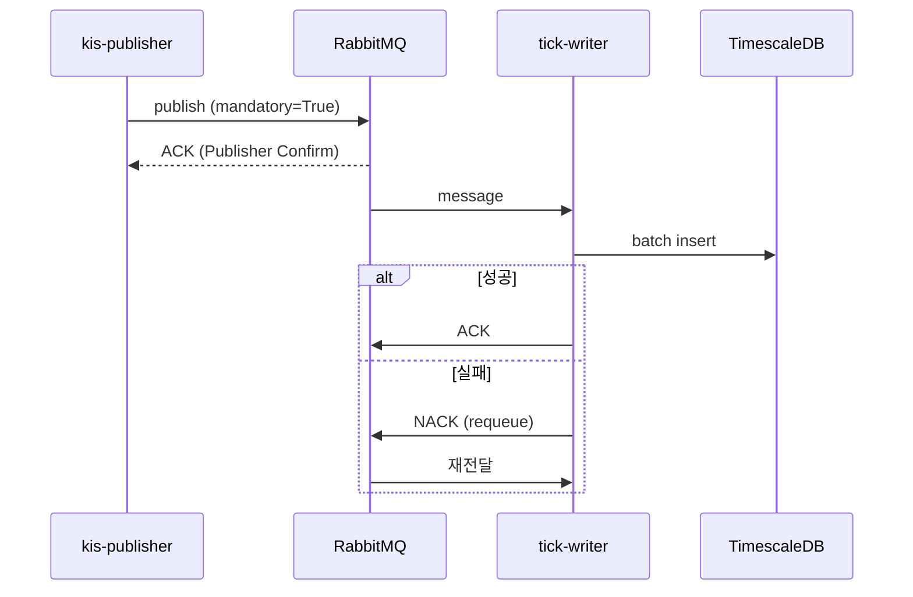

# 주가 데이터 실시간 저장 파이프라인

## 아키텍처



## 컴포넌트 역할

| 컴포넌트 | 역할 |
|----------|------|
| kis-publisher | KIS 체결 데이터 수신 → RabbitMQ 발행 |
| RabbitMQ | Fanout Exchange로 메시지 분배 |
| tick-writer | 배치 버퍼링 (200개/5초) → DB 저장 |
| TimescaleDB | Hypertable (stock_ticks) |

## 신뢰성 보장



| 구간 | 메커니즘 |
|------|----------|
| Publisher → Broker | Publisher Confirms + mandatory |
| Broker → Consumer | Manual ACK + requeue on failure |
| Consumer → DB | 버퍼 복구 후 NACK |

## 핵심 코드

### kis-publisher (발행)

> 출처: `kis-publisher/main.py`

```python
# Publisher Confirms 활성화 (채널 생성 시 옵션으로 설정)
rabbitmq_channel = await rabbitmq_connection.channel(publisher_confirms=True)

# Exchange 선언 (Fanout 타입)
rabbitmq_exchange = await rabbitmq_channel.declare_exchange(
    "stock.realtime",
    aio_pika.ExchangeType.FANOUT,
    durable=True
)
```

```python
# RabbitMQ에 메시지 발행 (Publisher Confirm 사용)
rabbitmq_message = aio_pika.Message(
    body=json.dumps(parsed_data).encode(),
    content_type="application/json",
    delivery_mode=aio_pika.DeliveryMode.PERSISTENT
)
try:
    # Publisher Confirm: 메시지가 RabbitMQ에 도달했는지 확인
    await rabbitmq_exchange.publish(
        rabbitmq_message,
        routing_key="",
        mandatory=True  # 라우팅 실패 시 예외 발생
    )
    publish_metrics.record_success()
except DeliveryError as e:
    publish_metrics.record_failure(
        parsed_data['stock_code'],
        f"DeliveryError: {e}"
    )
```

**Publisher Confirm 동작 방식:**

1. `publisher_confirms=True`로 채널 생성 → confirm 모드 활성화
2. `await publish()`가 브로커의 ACK 응답을 **동기적으로 대기**
3. 브로커가 메시지를 수신하면 ACK → `publish()` 정상 반환
4. 브로커가 거부하면 NACK → `DeliveryError` 예외 발생
5. `mandatory=True`: 라우팅할 큐가 없으면 `DeliveryError` 발생

```
Publisher                    RabbitMQ Broker
    │                              │
    │──── publish() ──────────────>│
    │          (await 대기)         │
    │                              │ 메시지 수신 완료
    │<─────────── ACK ─────────────│
    │                              │
    │  publish() 반환 (성공)        │
```

### tick-writer (소비) - 수동 ACK/NACK

> 출처: `tick-writer/main.py`

```python
channel = await connection.channel()
await channel.set_qos(prefetch_count=200)  # 배치 크기

# Queue 선언
# 주의: TTL 제거됨 - 메시지가 처리될 때까지 유지
# x-max-length만 유지하여 디스크 공간 보호
queue = await channel.declare_queue(
    QUEUE_NAME,
    durable=True,
    arguments={
        "x-max-length": 1000000,  # 최대 메시지 수 (초과 시 오래된 것부터 삭제)
    }
)
```

```python
# Consumer (수동 ACK/NACK 모드)
async with queue.iterator() as queue_iter:
    async for message in queue_iter:
        try:
            # 메시지 파싱
            data = json.loads(message.body)

            # 버퍼에 메시지와 데이터 함께 저장 (나중에 ACK/NACK 위해)
            async with self.lock:
                self.buffer.append({"data": data, "message": message})

            # 배치 크기 도달 시 즉시 저장 (저장 후 ACK)
            if len(self.buffer) >= self.batch_size:
                await self.save_to_database(pool)

        except json.JSONDecodeError as e:
            # JSON 파싱 실패 시 메시지 버림 (수동 ACK)
            await message.ack()
        except Exception as e:
            # 예외 발생 시 수동 NACK (재큐잉)
            await message.nack(requeue=True)
```

**수동 ACK/NACK 동작 방식:**

1. 메시지 수신 → 버퍼에 메시지 객체와 함께 저장
2. 배치 크기 도달 또는 flush_interval
3. DB 저장 시도
4. **성공** → 해당 배치의 모든 메시지 `message.ack()` 호출
5. **실패** → 해당 배치의 모든 메시지 `message.nack(requeue=True)` 호출

```
Consumer                     RabbitMQ Broker
    │                              │
    │<──── message 전달 ───────────│
    │                              │
    │  buffer.append(message)      │  (ACK 하지 않음)
    │  ...                         │
    │  buffer 가득 참               │
    │  save_to_database()          │
    │                              │
    │  [DB 저장 성공]               │
    │────── message.ack() ────────>│  → 메시지 삭제
    │                              │
    │  [DB 저장 실패]               │
    │── message.nack(requeue) ────>│  → 메시지 재삽입
```

| 상황 | 동작 | 결과 |
|------|------|------|
| DB 저장 성공 | 수동 ACK | 메시지 삭제 |
| DB 저장 실패 | 수동 NACK + requeue | 큐에 재삽입 (재처리) |
| `json.JSONDecodeError` | 수동 ACK | 파싱 불가 메시지 버림 |
| 기타 예외 | 수동 NACK + requeue | 큐에 재삽입 (재처리) |

### tick-writer (DB 저장 + 수동 ACK/NACK)

> 출처: `tick-writer/main.py`

```python
async def save_to_database(self, pool):
    async with self.lock:
        current_batch = self.buffer
        self.buffer = []

    # 메시지와 데이터 분리
    messages = [item["message"] for item in current_batch]
    data_list = [item["data"] for item in current_batch]

    try:
        async with pool.acquire() as conn:
            insert_query = """
                INSERT INTO stock_ticks (stock_code, symbol, time, price, volume)
                VALUES ($1, $2, $3, $4, $5)
                ON CONFLICT (stock_code, time) DO UPDATE SET
                    price = EXCLUDED.price,
                    volume = stock_ticks.volume + EXCLUDED.volume,
                    symbol = COALESCE(EXCLUDED.symbol, stock_ticks.symbol)
            """
            await conn.executemany(insert_query, records)

            # 저장 성공 → 모든 메시지 수동 ACK
            for msg in messages:
                await msg.ack()
            print(f"[ACK] Acknowledged {len(messages)} messages")

    except Exception as e:
        # 저장 실패 → 모든 메시지 수동 NACK (재큐잉)
        for msg in messages:
            await msg.nack(requeue=True)
        print(f"[NACK] Requeued {len(messages)} messages for retry")
        raise
```

**DB 저장 + ACK/NACK 동작 방식:**

1. 버퍼에서 배치 추출 → 버퍼 비움 (새 메시지 수신 가능)
2. 메시지 객체와 데이터 분리
3. `executemany()`로 배치 INSERT (UPSERT)
4. **성공** → 배치 내 모든 메시지 ACK
5. **실패** → 배치 내 모든 메시지 NACK (재큐잉)

```
tick-writer                  TimescaleDB                 RabbitMQ
    │                              │                         │
    │  current_batch = buffer      │                         │
    │  buffer = []                 │                         │
    │                              │                         │
    │──── executemany() ──────────>│                         │
    │                              │                         │
    │  [성공]                       │                         │
    │<─────── OK ──────────────────│                         │
    │                              │                         │
    │──────────────────── ack() ─────────────────────────────>│ × N개
    │                              │                         │
    │  [실패]                       │                         │
    │<─────── Error ───────────────│                         │
    │                              │                         │
    │────────────────── nack(requeue) ───────────────────────>│ × N개
```

**UPSERT 전략 (`ON CONFLICT`):**

```sql
ON CONFLICT (stock_code, time) DO UPDATE SET
    price = EXCLUDED.price,                    -- 최신 가격으로 덮어쓰기
    volume = stock_ticks.volume + EXCLUDED.volume,  -- 거래량 누적
    symbol = COALESCE(EXCLUDED.symbol, stock_ticks.symbol)  -- NULL 방지
```

| 상황 | 동작 |
|------|------|
| 새 데이터 | INSERT |
| 중복 (stock_code, time) | UPDATE (가격 갱신, 거래량 누적) |
