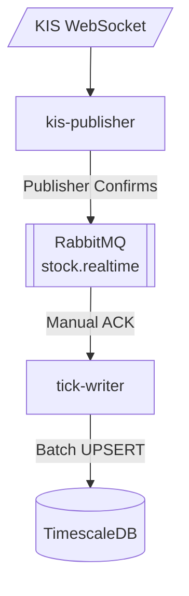
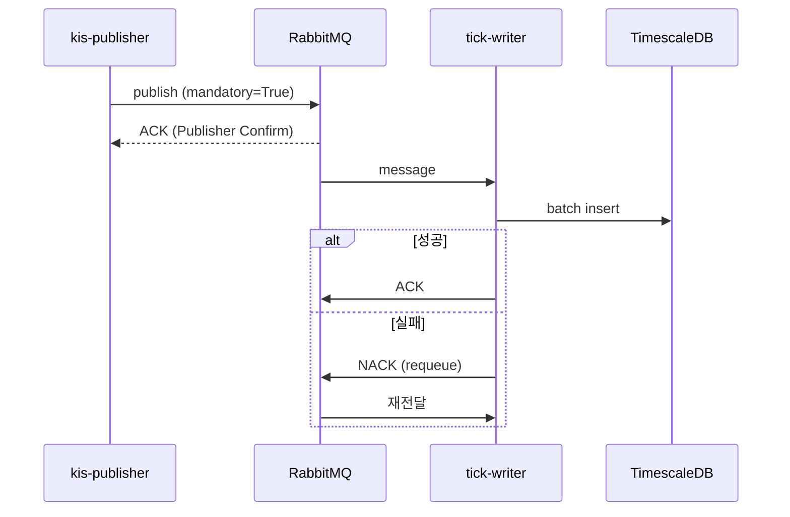

# 주가 데이터 실시간 저장 파이프라인

## 아키텍처



## 컴포넌트 역할

| 컴포넌트 | 역할 |
|----------|------|
| kis-publisher | KIS 체결 데이터 수신 → RabbitMQ 발행 |
| RabbitMQ | Fanout Exchange로 메시지 분배 |
| tick-writer | 배치 버퍼링 (200개/5초) → DB 저장 |
| TimescaleDB | Hypertable (stock_ticks) |

## 신뢰성 보장



| 구간 | 메커니즘 |
|------|----------|
| Publisher → Broker | Publisher Confirms + mandatory |
| Broker → Consumer | Manual ACK + requeue on failure |
| Consumer → DB | 버퍼 복구 후 NACK |

## 핵심 코드

### kis-publisher (발행)

```python
# Publisher Confirms 활성화
channel = await connection.channel(publisher_confirms=True)

exchange = await channel.declare_exchange(
    "stock.realtime",
    aio_pika.ExchangeType.FANOUT,
    durable=True
)

# 메시지 발행 (mandatory=True로 라우팅 실패 감지)
message = aio_pika.Message(
    body=json.dumps(parsed_data).encode(),
    delivery_mode=aio_pika.DeliveryMode.PERSISTENT
)

try:
    await exchange.publish(message, routing_key="", mandatory=True)
    # 브로커 ACK 수신 → 성공
except DeliveryError as e:
    # 브로커 NACK 또는 라우팅 실패
    print(f"Publish failed: {e}")
```

### tick-writer (소비)

```python
await channel.set_qos(prefetch_count=200)

queue = await channel.declare_queue(
    "stock.ticks.writer",
    durable=True,
    arguments={"x-max-length": 1000000}
)

async with queue.iterator() as queue_iter:
    async for message in queue_iter:
        try:
            # 실패 시 requeue=True로 재큐잉
            async with message.process(requeue=True):
                data = json.loads(message.body)
                buffer.append(data)

                if len(buffer) >= 200:
                    await save_to_database(buffer)
                    buffer.clear()

        except json.JSONDecodeError:
            # 파싱 불가 메시지는 버림
            await message.ack()
```

### tick-writer (DB 저장)

```python
async def save_to_database(buffer):
    try:
        await conn.executemany("""
            INSERT INTO stock_ticks (stock_code, symbol, time, price, volume)
            VALUES ($1, $2, $3, $4, $5)
            ON CONFLICT (stock_code, time) DO UPDATE SET
                price = EXCLUDED.price,
                volume = stock_ticks.volume + EXCLUDED.volume
        """, records)
    except Exception as e:
        # 실패 시 버퍼 복구 → NACK으로 재처리
        self.buffer = current_batch + self.buffer
        raise
```
